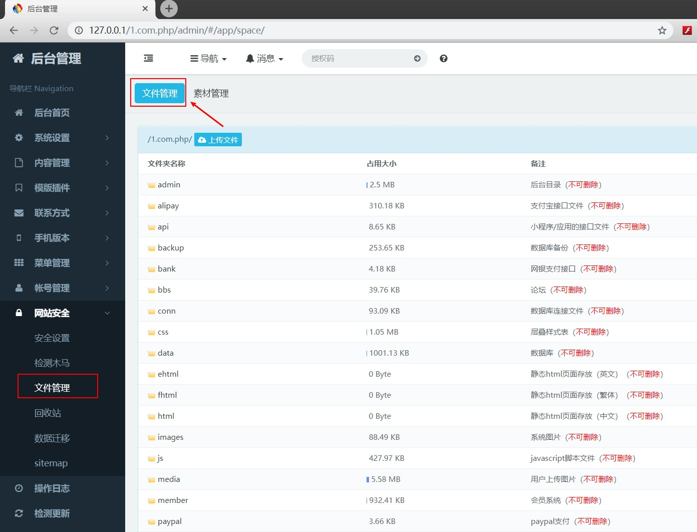

## S-CMS(PHP enterprise edition)v3.0 backstage getshell

## introduction

The attacker login to the system background management page, can attack the server through the PHP one-sentence Trojan horse, obtain the control authority of the server, seriously threaten the security of server assets, and this CMS belongs to the commercial, the influence range is very wide.

## exploit

### 1.When using an administrator's account to entry the backstage web page, users could modify any documents of Document Management in the program of Website Safety. (as shown in illustration)
											

### 2.	Try to unfold any one of PHP documents, modify it, input a line code of PHP and then save it.

### 3.	Connecting with Cknife, the password is cmd111(as shown in illustration), enabling to getshell directly.

### 4. Bug code download([click the link](https://www.s-cms.cn/download.html?code=php)).

